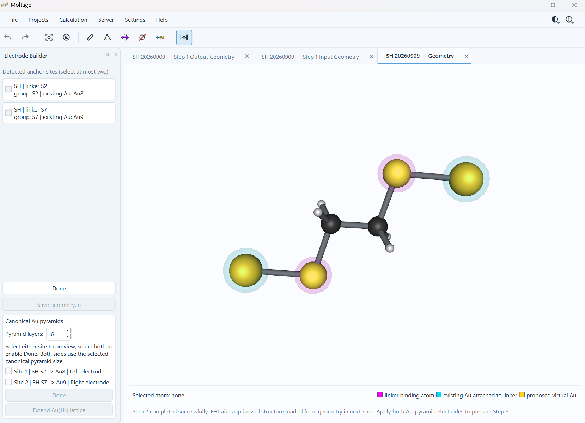
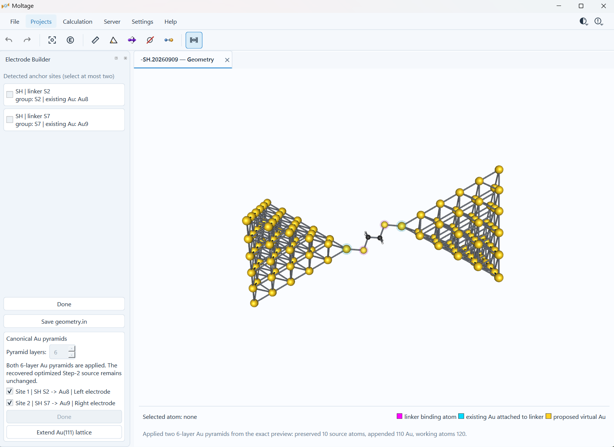
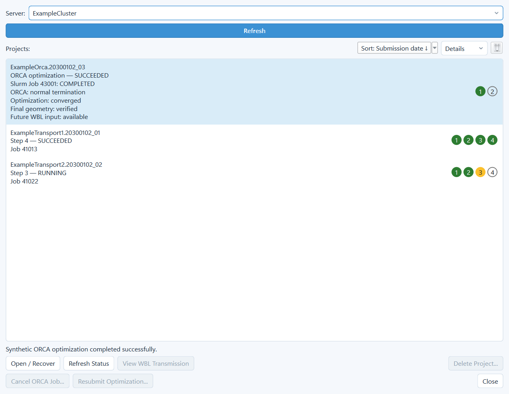

# Moltage

<p align="center">
  
</p>

<p align="center">
  <strong>Single-Molecule Quantum Transport &amp; Analysis Workbench</strong>
</p>

<p align="center">
  A Windows desktop application for building molecular junctions, running structured remote calculations, and inspecting electronic-structure and transport results in one workspace.
</p>

<p align="center">
  <a href="https://github.com/junfeng-sb/Moltage/releases/tag/v0.2.1">Download v0.2.1</a>
  · <a href="docs/WORKFLOW.md">Workflows</a>
  · <a href="docs/CONFIGURATION.md">Configuration</a>
  · <a href="LICENSE">GPL-3.0-only</a>
</p>

> **Development release:** v0.2.1 is an early public checkpoint. Review all
> scientific inputs independently and retain the generated provenance records.
> Moltage's offline tests validate application logic; they do not certify a
> particular ORCA, FHI-aims, AITRANSS, SSH, scheduler, or HPC installation.

<p align="center">
  
</p>

Moltage connects molecular preparation, remote scientific programs and result
inspection without treating scheduler completion as scientific success. It is
designed for explicit, reviewable workflows: users select scientific settings,
external programs remain user supplied, and unsupported or incomplete evidence
fails visibly instead of falling back silently.

## Highlights

- **Molecular workspace** — open XYZ, MOL V2000, FHI-aims geometry and Cube
  files; inspect connectivity, labels, measurements, orbitals and scalar fields.
- **Contact-aware electrode construction** — detect supported linker sites,
  place contact Au atoms and build deterministic 2–10 layer Au pyramids, with
  interactive same-layer Au(111) extension.
- **FHI-aims + AITRANSS workflow** — manage molecular optimization,
  molecule–Au optimization, transport convergence and validated transmission
  recovery on Slurm or IBM Spectrum LSF systems.
- **ORCA workflow** — submit version-aware geometry optimization, optionally run
  frequency calculations, and start an explicit post-optimization WBL analysis
  from verified wavefunction evidence.
- **Transport inspection** — view logarithmic transmission curves, Fermi-level
  values and spin-resolved ORCA WBL output, then export the current visual state.
- **Project tracking** — preserve scheduler, program and scientific states as
  separate evidence while monitoring multiple calculations.
- **Local analysis** — run the independent tight-binding workspace without an
  HPC connection; remote electron-density-difference analysis is also available.

## Visual tour

### Build a molecular junction

Moltage reuses detected linker/contact identities throughout electrode
preparation. The canonical electrode geometry is generated by Moltage rather
than loaded from a bundled third-party cluster template.

<table>
  <tr>
    <td width="50%"></td>
    <td width="50%"></td>
  </tr>
  <tr>
    <td align="center"><sub>Recovered contact geometry and electrode-side assignment</sub></td>
    <td align="center"><sub>Completed two-sided canonical Au junction</sub></td>
  </tr>
</table>

### Inspect molecular orbitals

Recovered frontier-orbital Cube files can be loaded on demand over the matching
geometry. Isovalue, color, material and lighting controls affect presentation
only; they do not modify calculation inputs.

<p align="center">
  
</p>

### Review transport results

FHI-aims/AITRANSS and ORCA WBL results use dedicated viewers. The plots below
were generated from **synthetic demonstration data** and are not scientific
results or external-environment acceptance evidence.

<table>
  <tr>
    <td width="50%"></td>
    <td width="50%"></td>
  </tr>
  <tr>
    <td align="center"><sub>Validated non-spin AITRANSS T(E) presentation</sub></td>
    <td align="center"><sub>Linker-parameterized ORCA WBL HYPOTHESIS presentation</sub></td>
  </tr>
</table>

The ORCA WBL path reuses an existing verified optimization wavefunction and
does not run another SCF or geometry optimization. Its coupling parameters are
explicit user inputs, and its output is always identified as a
linker-parameterized **HYPOTHESIS**, not an explicit Au–molecule–Au DFT-NEGF
result.

### Track calculation state

The Project Manager distinguishes queued/running scheduler state, program
termination and scientific validation. The example below is entirely synthetic.

<p align="center">
  
</p>

## Supported workflows

| Workflow | Current scope |
| --- | --- |
| FHI-aims + AITRANSS | Four managed stages from molecular optimization through non-spin transmission recovery; Slurm and LSF submission are supported. |
| ORCA | Geometry optimization on Slurm or LSF, optional frequency analysis, and post-optimization linker-parameterized WBL transmission. |
| Local analysis | Molecular/Cube viewing, electrode preparation and an independent one-orbital tight-binding transmission workspace. |
| Density difference | Independent remote FHI-aims density-difference task with explicit fragment selection and result recovery. |

Remote workflows currently target Linux/POSIX environments reached from the
Windows application through a saved SSH server profile. Scheduler settings and
FHI-aims, AITRANSS and ORCA runtime settings are separated: users configure only
the programs required by the workflow they intend to run.

FHI-aims, AITRANSS and ORCA are **not bundled**. Users must provide properly
licensed installations and valid access to the selected server.

## Install v0.2.1

The packaged application targets 64-bit Windows.

1. Open the [v0.2.1 release](https://github.com/junfeng-sb/Moltage/releases/tag/v0.2.1).
2. Download `Moltage-Setup-0.2.1.exe` and its adjacent `.sha256` file.
3. Verify the installer:

   ```powershell
   Get-FileHash .\Moltage-Setup-0.2.1.exe -Algorithm SHA256
   ```

4. Compare the reported hash with the published checksum, then run the
   installer.

The v0.2.1 development installer is unsigned, so Windows SmartScreen may show
an unrecognized-publisher warning. The checksum verifies file integrity; it
does not establish publisher identity.

Moltage can open and inspect supported local files without an HPC account.
Remote calculations require a configured server profile and the corresponding
external scientific program.

## First steps

1. Open a supported molecular structure from **File**.
2. Inspect the inferred or explicit connectivity and identify the two linker
   sites.
3. Use the Electrode Builder when contact-Au or canonical electrode geometry is
   needed.
4. For remote work, create a server profile and configure only the relevant
   program page under **Server**.
5. Start the selected workflow under **Calculation** and monitor it from
   **Projects**.
6. Recover validated geometries or results into the tabbed workspace.

Detailed behavior and boundaries are documented in:

- [Project scope](docs/PROJECT_SCOPE.md)
- [Target workflows](docs/WORKFLOW.md)
- [Server and program configuration](docs/CONFIGURATION.md)
- [Architecture](docs/ARCHITECTURE.md)
- [Electron-density difference](docs/ELECTRON_DENSITY_DIFFERENCE.md)

## Scientific and validation boundaries

- Moltage does not choose a scientifically correct method, basis, charge,
  multiplicity, coupling strength or server resource request for the user.
- WBL and local tight-binding results depend on explicit model assumptions and
  must not be presented as explicit DFT-NEGF calculations.
- A scheduler `COMPLETED` state is necessary but not sufficient evidence of
  program or scientific success.
- Synthetic offline fixtures verify deterministic application behavior; real
  HPC/program acceptance remains site specific.
- FHI-aims species definitions are read from the user's configured server and
  are not distributed with Moltage.

## Development

Moltage requires Python 3.11 or later for source development.

```powershell
py -m pip install -e ".[test]"
.\tools\run_tests.ps1 -Full
```

Focused tests are preferred for small changes. The full offline suite is used
for scientific behavior, schema/persistence, scheduler/security or other
cross-layer changes, and for formal release checkpoints. See
[maintenance guidance](docs/MAINTENANCE.md) and
[release guidance](docs/RELEASING.md).

## License and third-party software

Copyright (C) 2026 Junfeng Lin.

Moltage is free software distributed under the
[GNU General Public License version 3 only](LICENSE). The Windows distribution
uses the GPLv3 option for Qt/PySide and Qt Charts. Third-party components retain
their own copyrights and license terms; see
[THIRD_PARTY_NOTICES.md](THIRD_PARTY_NOTICES.md) and [LICENSES/](LICENSES/).

Binary releases publish the corresponding Moltage source and third-party source
bundle alongside the installer. Security issues should be reported privately as
described in [SECURITY.md](SECURITY.md).
