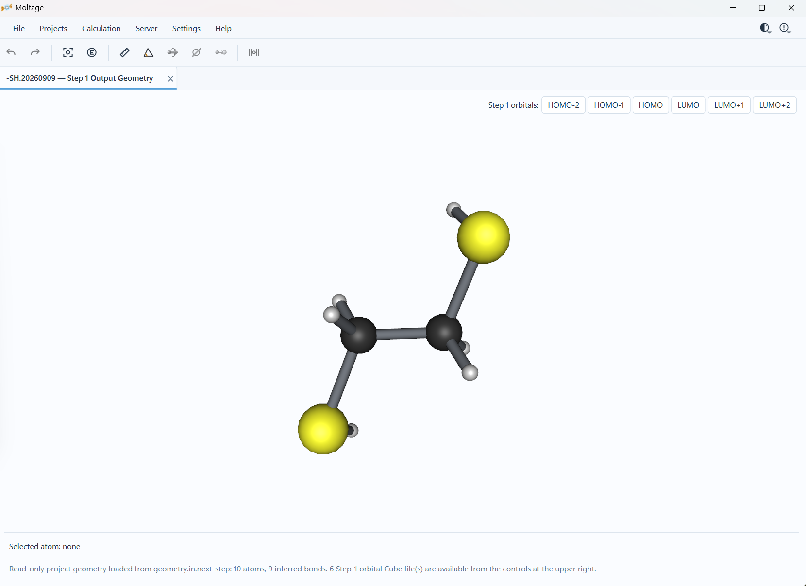
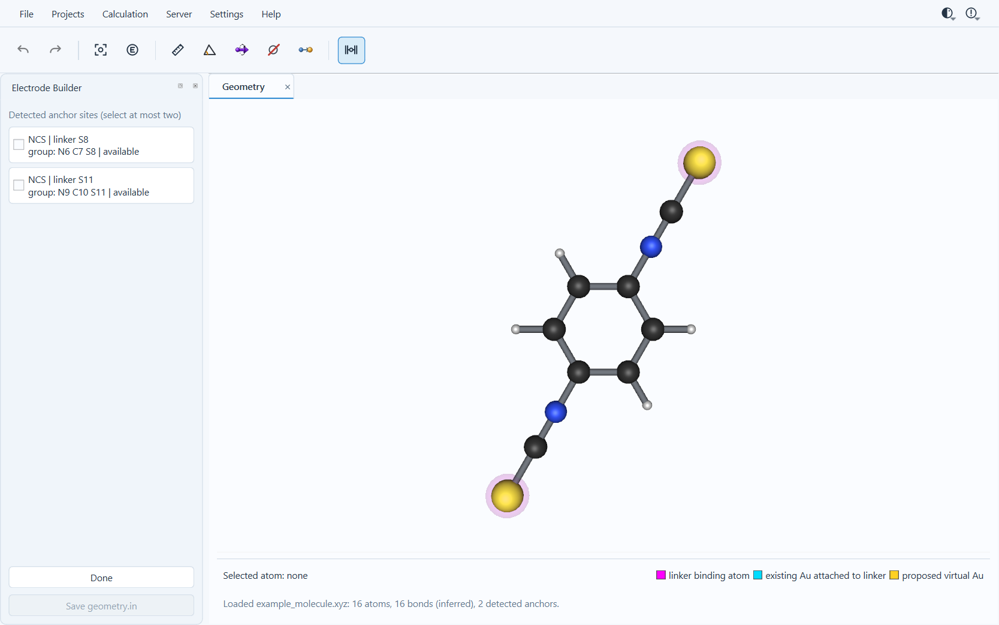
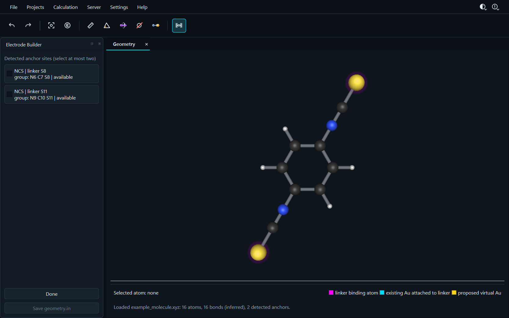

# 1–4. Getting Started

[Back to the manual index](README.md)

## 1. About Moltage

Moltage is a Windows desktop workbench for preparing molecular structures,
building Au–molecule junction geometries, running structured calculations on a
configured Linux server, and inspecting selected electronic-structure and
transport results.

The v0.2.1 release contains three distinct calculation families:

- **FHI-aims + AITRANSS**: a managed four-stage path from molecular
  optimization to non-spin transmission inspection.
- **ORCA**: molecular optimization, optional frequency analysis, and an
  explicitly selected post-optimization WBL model.
- **Independent analysis**: local tight-binding transmission and remote
  FHI-aims electron-density difference tasks.

Moltage does not bundle FHI-aims, AITRANSS, or ORCA. The user must have lawful
access to those programs and configure the corresponding server paths.

> **Scientific-input note:** Moltage does not choose the scientifically correct
> functional, basis, charge, multiplicity, spin state, coupling strength,
> convergence criterion, scheduler allocation, or server environment. Review
> all starting values for the intended system.

## 2. Installation and first launch

### 2.1 Requirements

- 64-bit Windows.
- A supported graphics environment for the Qt/VTK molecular viewer.
- No server account is required for local viewing and local tight binding.
- A saved SSH server profile is required for remote calculations.

### 2.2 Install Moltage v0.2.1

1. Open the [v0.2.1 release page](https://github.com/junfeng-sb/Moltage/releases/tag/v0.2.1).
2. Download `Moltage-Setup-0.2.1.exe`.
3. Run the installer, choose an installation directory, and decide whether to
   create the desktop shortcut.

Windows may display a permission or security prompt. Confirm that the installer
came from the official release page before continuing.

### 2.3 User data and uninstall

The installer owns application files, not the user's Moltage state. Profiles,
known projects, host keys, selected theme, and diagnostic state are stored
outside the installation directory under the user's Windows application-data
locations. Saved passwords use Windows Credential Manager. Uninstalling the
program deliberately leaves this user state in place.

### 2.4 First launch

Moltage opens without connecting to a server. An empty Geometry workspace
contains an **Open...** button and a supported-file hint. Remote connections
occur only after an explicit server-related operation.

## 3. Interface overview

  

**Figure 1.** Main workspace with a demonstration structure. The orbital
controls at the upper right appear only when frontier-orbital output was
selected during molecular optimization and the corresponding files are
available.

### 3.1 Main-window areas

| Area | Purpose |
| --- | --- |
| Menu bar | File, project, calculation, server, settings, and help commands |
| Main toolbar | Direct geometry/view tools for the active tab |
| Workspace tabs | Independent Geometry, Transmission, Density, or local-analysis work objects |
| Electrode Builder | Linker recognition, contact Au placement, pyramid construction, and lattice extension |
| Scientific canvas | Molecular/Cube viewer or transmission chart |
| Bottom status area | Selected atom, operation result, measurement table, or current workflow message |
| Upper-right controls | Theme selector and bundled Update Log |

Switching tabs changes which commands are available. Geometry editing actions
are disabled on Transmission, Density-result, read-only, and other incompatible
workspaces.

### 3.2 Toolbar buttons

The toolbar is ordered from left to right.

| Button | Purpose | Changes geometry? |
| --- | --- | --- |
| **Undo** | Restore the preceding state in the active Geometry workspace's five-level edit history | Yes, by restoring a prior state |
| **Redo** | Reapply an undone geometry edit | Yes |
| **Reset View** | Reset the active molecular camera or transmission ranges | No |
| **Element Labels** | Show or hide element-symbol labels | No |
| **Measure Distance** | Repeatedly select two distinct atoms and show distance in Å | No |
| **Measure Angle** | Repeatedly select A–B–C and show the angle at B in degrees | No |
| **Rotate Bond** | Select an eligible Connectivity edge and rotate one connected component rigidly | Yes |
| **Delete Atom** | Repeatedly delete selected atoms until the mode is exited | Yes |
| **Replace Atom** | Choose a supported element, then replace selected atom identities | Yes |
| **Electrode Builder** | Show or hide the left Electrode Builder dock | No by itself |

Tool buttons that operate on atoms are mutually exclusive. Press **Escape** or
toggle the active tool off to leave its pick mode. A command can be disabled
because no Geometry tab is active, the geometry is read-only, or a workflow
allows coordinate changes only.

### 3.3 Menu map

| Menu | Command | Purpose |
| --- | --- | --- |
| File | **New Geometry...** | Open a supported local structure or Cube file |
| File | **Export Current View...** | Export the active scientific canvas as PNG, JPG/JPEG, or raster-backed PDF at 1×–8× resolution |
| Projects | **Project Manager...** | Manage submitted calculations, inspect current status, and perform available follow-up actions |
| Calculation > FHI-aims | **Step 1 — Molecule Optimization...** | Start a managed molecular optimization |
| Calculation > FHI-aims | **Step 2 — Molecule–Au Optimization...** | Continue a submitted project or start directly from an eligible two-contact structure |
| Calculation > FHI-aims | **Step 3 — Transport Convergence...** | Submit the fixed-geometry transport-convergence calculation |
| Calculation > FHI-aims | **Step 4 — Transmission...** | Prepare and submit AITRANSS after validated Step 3 |
| Calculation > FHI-aims | **Electron Density Difference...** | Open an independent three-component density-difference task |
| Calculation > ORCA | **Step 1 — Optimization...** | Start ORCA molecular optimization |
| Calculation > ORCA | **Step 2 — WBL Transmission...** | Analyze a verified completed ORCA wavefunction without a new SCF/optimization |
| Calculation > ORCA | **Run Frequency...** | Submit optional frequency verification for a completed ORCA optimization |
| Calculation | **Local Tight-Binding Transmission...** | Open a session-local one-orbital model |
| Server | **Manage Servers...** | Create and edit SSH server profiles |
| Settings | **View...** | Edit molecular, Cube, or transmission presentation settings |
| Settings | **Bond Detection...** | Preview the inferred-connectivity threshold for inferred graphs |
| Settings | **Email Notifications...** | Configure optional scheduler-native terminal email for one server profile |
| Help | **License and Third-Party Notices...** | Read the bundled license and third-party notices |
| Help | **About Moltage** | Display application/version information |
| Upper-right Theme control | Theme choices | Select a registered Light or Dark theme |
| Upper-right Updates control | **Update Log...** | Read the bundled, offline update log |

Commands are enabled contextually. For example, ORCA WBL is disabled until the
active Geometry workspace is bound to a verified successful managed ORCA
optimization with the required `.gbw` evidence.

### 3.4 Workspace tabs

- Each opened canonical local path has one live Geometry workspace.
- Dropping or opening a file that is already open focuses its current edited
  workspace instead of rereading it.
- Closing a tab discards local presentation/session state only. It does not
  cancel a remote calculation.
- Managed result identities are deduplicated: reopening the same successful
  transmission result focuses its existing tab.
- The close button on a workspace is not a remote-delete command.

### 3.5 Theme selector

Use the upper-right theme button to choose from several Light and Dark themes.
The following views show one example from each group:

  

**Light theme example.**

  

**Dark theme example.**

The selected theme is remembered for the current user. A theme changes only
the interface presentation and atom-feedback colors; it does not alter
coordinates, scientific values, server settings, or generated inputs.

## 4. Opening and viewing molecular structures

### 4.1 Supported local formats

| Extension | Supported scope |
| --- | --- |
| `.xyz` | Strict four-column molecular XYZ; Connectivity is inferred geometrically |
| `.mol` | One MOL V2000 record with explicit type-1, type-2, or type-3 bonds |
| `.in` | Local FHI-aims molecular geometry |
| `.next_step` | Complete standalone FHI-aims next-step molecular geometry |
| `.cube`, `.cub` | One signed scalar dataset; supported ORCA/Gaussian orbital form or explicitly confirmed FHI-aims/unidentified coordinate units |

Not supported in v0.2.1 include V3000, SDF, aromatic/type-4 MOL bonds,
multi-dataset Cube files, formal-charge visualization, and bond-order editing.
Malformed input fails explicitly; Moltage does not silently try a different
parser.

### 4.2 Open files

Use either method:

1. **File > New Geometry...**, then select one or more supported files.
2. Drag local supported files onto the main workspace.

Multi-file drops open supported files in source order. Directories, non-local
URLs, and unsupported suffixes are reported and do not reach a parser.

### 4.3 Viewer interaction

- **Rotate**: drag in the molecular canvas with the normal trackball gesture.
- **Zoom**: use the mouse wheel.
- **Inspect atom**: pause over an atom to show an open ring and its atom number.
- **Select atom**: click when the active tool requests an atom.
- **Reset camera**: press **Reset View**.

The viewer renders supplied atomic centers and Connectivity. It does not infer
chemical identity, valence, aromaticity, or electrode role from the rendered
image.

### 4.4 Element labels and hydrogen visibility

The toolbar **Element Labels** button toggles symbols immediately. More controls
are available in **Settings > View... > Molecule**:

| Setting | Default | Purpose |
| --- | --- | --- |
| Bond thickness | `1.00×` | Scales displayed bond strands only |
| Element labels | Off | Shows unpickable element-symbol billboards |
| Hide hydrogen atoms | Off | Hides H glyphs, H labels, H-incident strands, and H feedback without deleting atoms |
| Atom colors | Built-in palette | Allows session-local per-element display overrides |

Changes preview immediately across open Geometry tabs. **OK** keeps the current
session state; **Cancel** restores the state present when the dialog opened.
Only approved Cube material/lighting values and the theme ID persist across
application launches; the ordinary molecular-view choices above do not.

### 4.5 Bond Detection

**Entry:** `Settings > Bond Detection...`

For inferred graphs, Moltage uses:

`distance(i,j) <= factor × (covalent radius(i) + covalent radius(j))`

The factor defaults to `1.10`, accepts `0.01`–`10.00`, displays two decimals,
and changes by `0.10` steps. Every value change previews regenerated inferred
edges. **OK** keeps the previewed factor/graphs; **Cancel** restores the exact
pre-dialog graphs. Explicit MOL V2000 connectivity is unaffected.

This is approximate connectivity for application operations. It is not a bond
order, valence, or chemical-structure determination.

### 4.6 Measurements

**Distance** uses two distinct atom picks and reports Å. **Angle** uses picks
A, B, and C and reports the A–B–C angle at B in degrees.

- The active tool remains on for repeated measurements.
- Incomplete picks use amber highlights and 1/2/3 labels.
- Press **Escape** to clear only the incomplete pick sequence.
- Completed measurements appear in the bottom measurement panel.
- Right-click a row and select **Delete measurement** to remove one result.
- **Clear** removes all completed and incomplete measurements in the active
  Geometry workspace but leaves the selected measurement tool active.
- Measurements are not written into geometry or calculation inputs.

Replacing an atom preserves completed measurements. Deleting an atom removes
only measurements that refer to it and remaps surviving atom indexes.

### 4.7 Rotate Bond

1. Press **Rotate Bond**.
2. Click a rendered Connectivity edge.
3. If removing that edge would split its connected component, Moltage shows the
   torsion controls. Ring edges and other edges with an alternate endpoint path
   are rejected.
4. Drag the rotation handle or click the displayed angle for exact signed input.
5. Use the side-switch control to keep the opposite component fixed; the current
   coordinates become the new `0.0°` baseline.

The smaller endpoint component moves rigidly; unrelated disconnected components
remain fixed. Rotation changes working coordinates, enters Undo/Redo, and clears
coordinate-dependent measurements after the first real motion. It does not
rewrite the opened source file or infer new bonds.

### 4.8 Delete Atom and Replace Atom

**Delete Atom** removes the clicked atom and incident edges and compacts indexes.
It remains active for repeated clicks until toggled off or Escape is pressed.

**Replace Atom** first opens a periodic table. Select an enabled element, then
click atoms to change only their element identity. Coordinates and Connectivity
are preserved. Both operations enter the same five-level Geometry Undo/Redo
history.

These tools are unavailable in read-only or coordinate-only workflow tabs.
Identity/topology edits can invalidate previously applied electrode provenance.

### 4.9 Save and export

- **Save geometry.in** in the Electrode Builder writes the current applied
  molecular geometry in FHI-aims geometry format when the button is eligible.
- **File > Export Current View...** exports the active visible scientific canvas.
  Choose output file, format (`PNG`, `JPG`/`JPEG`, or raster-backed `PDF`), and
  resolution (`1×`–`8×`). It exports pixels, not a new scientific dataset.
- Exporting a molecular/Cube view preserves the current camera and overlays.
- Exporting a transmission view includes its current presentation settings and
  annotations.

[Next: molecular preparation and electrodes](02_molecular_preparation.md)
