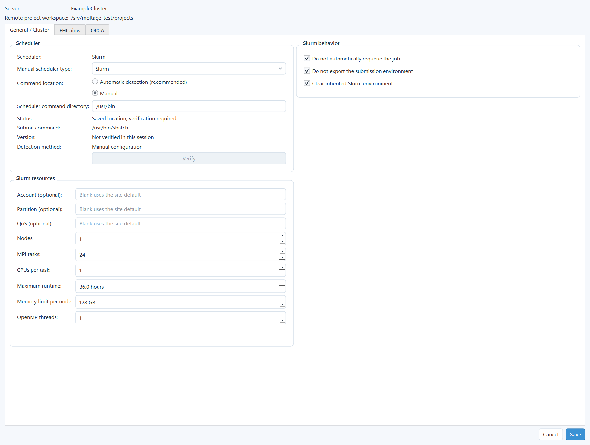
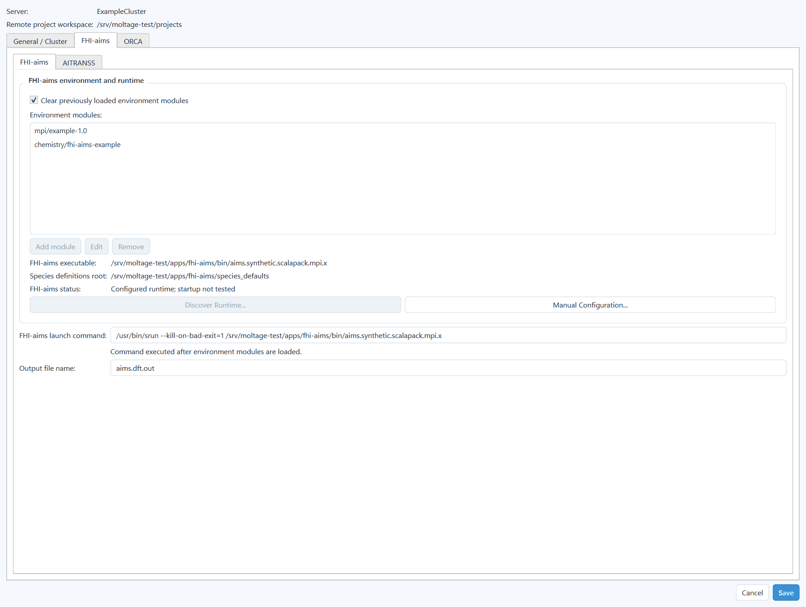
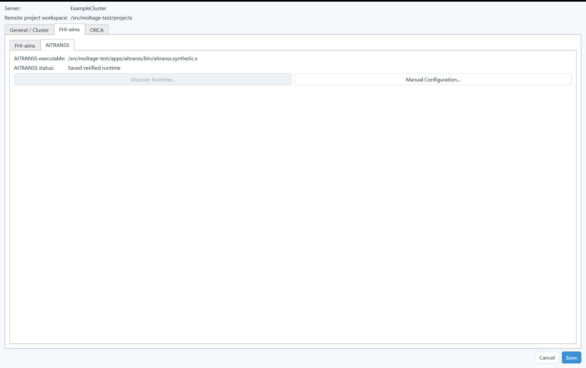
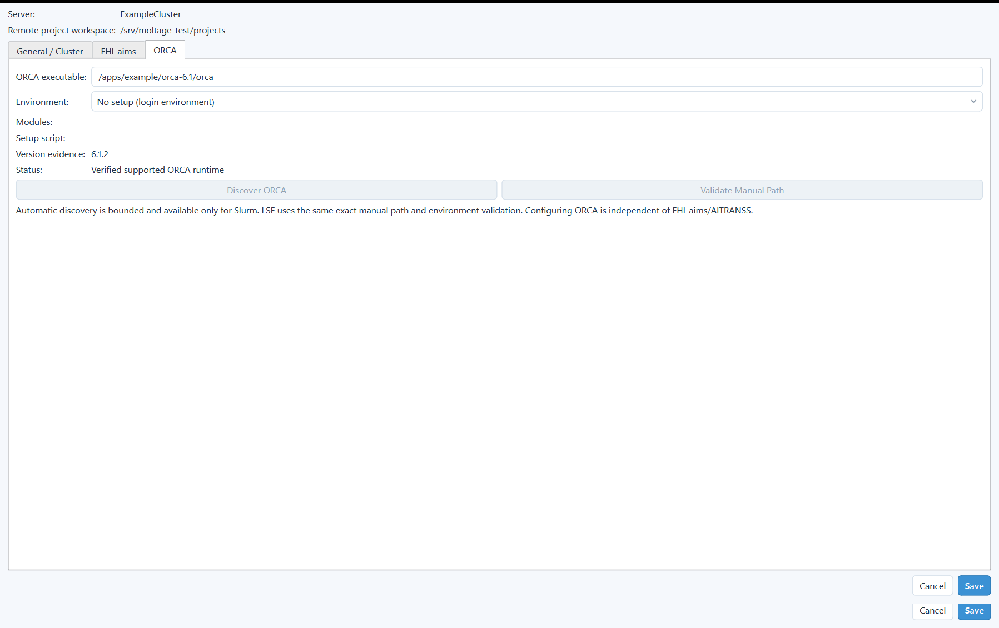

# 9–12. Servers, Schedulers, and Program Runtimes

[Back to the manual index](README.md)

Remote calculations require two different kinds of configuration:

1. **Server Connections** describes how to reach one SSH server and where
   Moltage project directories are stored.
2. **Cluster Execution Settings** describes the scheduler, job defaults, and
   external scientific programs available on that server.

You configure only the external program needed by your workflow. FHI-aims,
AITRANSS, and ORCA fields are not all required at once.

## 9. Server profiles

### 9.1 Open Server Connections

**Entry:** `Server > Manage Servers...`

No network connection is opened merely by opening this dialog.

### 9.2 Connection fields

| Field | Purpose |
| --- | --- |
| **Server profile** | Select an existing saved profile |
| **Profile name** | Local display name; it is not used as host identity |
| **Host** | SSH host name or address supplied by the site/user |
| **Port** | SSH port; starts at `22` for a new profile |
| **Username** | Remote login username |
| **Password** | Password used for explicit connection operations |
| Eye button | Temporarily show/hide the password field |
| **Save password securely** | Store the password in Windows Credential Manager, not profile JSON |
| **Auto connect** | Resolve saved credentials automatically when an explicit remote operation requests a short-lived connection |
| **Remote project workspace** | Existing absolute POSIX directory under which Moltage creates project directories |
| Folder button | Open a read-only remote directory chooser after connecting |

`Auto connect` does not connect at application startup and does not keep a
permanent SSH session open.

### 9.3 Server-profile buttons

| Button | Action |
| --- | --- |
| **Test Connection** | Open a short-lived SSH connection and report success/failure |
| **Cluster Settings...** | Edit scheduler resources and program runtimes for the working profile |
| **New** | Clear the form for a new profile |
| **Save** | Validate and save the current profile |
| **Save As** | Save the current values under a new profile identity |
| **Delete** | Delete the local profile and its associated saved credential; it does not delete remote projects |
| **Close** | Close the dialog after pending connection work has finished |

The first connection to an unknown SSH host presents the host-key fingerprint.
Trust it only after verifying the fingerprint through an independent site
channel. Accepted keys are stored in Moltage's application-owned known-hosts
file.

### 9.4 Remote project workspace chooser

The folder button lists existing remote directories only. **Up** moves to the
parent, **Refresh** reloads the current directory, **Select Folder** returns the
selected existing directory, and **Cancel** makes no change. It does not scan
the server, create directories, select files, or modify remote contents.

### 9.5 Credentials and privacy

- Passwords are never stored in `server_profiles.json`, project manifests,
  logs, screenshots, or repository files.
- v0.2.1 supports password SSH only. SSH keys, ssh-agent, and jump hosts are not
  implemented.
- The optional email recipient is profile data but is not a password.
- Do not include real hostnames, usernames, paths, project names, or captures
  when filing a public issue unless they are intentionally disclosed.

## 10. Scheduler settings

### 10.1 Open Cluster Execution Settings

From **Server Connections**, select a profile and press
**Cluster Settings...**. The dialog has three top-level pages:

- **General / Cluster**
- **FHI-aims**, containing separate FHI-aims and AITRANSS subtabs
- **ORCA**

The server name and remote project workspace at the top identify the profile
being edited. **Save** writes the complete working copy; **Cancel** writes
nothing.

  

**Figure 4.** General / Cluster settings configured for Slurm. The displayed
name, paths, and resources are examples rather than site recommendations.

### 10.2 Scheduler type and command location

Moltage v0.2.1 supports **Slurm** and **IBM Spectrum LSF**.

| Control | Meaning |
| --- | --- |
| **Scheduler** | Current detected/saved scheduler identity |
| **Manual scheduler type** | Choose Slurm or LSF when manual configuration is used |
| **Automatic detection (recommended)** | Find and validate the required scheduler client commands through bounded site evidence |
| **Manual** | Use the explicitly entered scheduler command directory |
| **Scheduler command directory** | Absolute remote directory containing the scheduler client commands |
| **Detect Scheduler / Verify** | Perform read-only validation; it does not submit a job |
| **Status** | Whether the location has been detected/verified |
| **Submit command** | Resolved `sbatch` or `bsub` path |
| **Version** | Scheduler version evidence when available |
| **Detection method** | How the saved command location was obtained |

Automatic detection is bounded. It does not recursively scan the server or
source an arbitrary site setup script.

### 10.3 Slurm resources

| Field | Required? | Meaning |
| --- | --- | --- |
| **Account** | Optional | `--account`; blank uses the site default |
| **Partition** | Optional | `--partition`; blank uses the site default |
| **QoS** | Optional | `--qos`; blank uses the site default |
| **Nodes** | Yes for jobs | Requested node count |
| **MPI tasks** | Yes | Scheduler task slots; FHI and ORCA renderers use this according to their workflow |
| **CPUs per task** | Yes | CPUs allocated to each scheduler task |
| **Maximum runtime** | Yes | Job walltime; stored canonically as whole minutes |
| **Memory limit per node** | Yes | Requested integer GB per node |
| **OpenMP threads** | Yes | OpenMP thread count used by supported renderers |

Moltage never guesses account, partition, or QoS. Blank explicitly delegates
admission to the scheduler/site default.

### 10.4 Slurm behavior

| Option | Purpose |
| --- | --- |
| **Do not automatically requeue the job** | Request no automatic requeue |
| **Do not export the submission environment** | Prevent accidental inheritance of the desktop/login submission environment |
| **Clear inherited Slurm environment** | Remove inherited Slurm variables before the configured runtime setup |

These are server/job-execution settings, not scientific parameters.

### 10.5 LSF resources and client directories

Manual LSF configuration additionally requires:

- **LSF configuration directory** (`LSF_ENVDIR`, containing `lsf.conf`);
- **LSF library directory** (`LSF_LIBDIR`);
- **LSF server directory** (`LSF_SERVERDIR`);
- the scheduler command directory as `LSF_BINDIR`.

The bundle is accepted only when `bsub`, `bjobs`, `bhist`, `bkill`, and `lsid`
are available and the exact environment initializes through read-only `lsid`.

LSF admission fields are optional:

- **Queue** — blank uses the site default.
- **Project** — blank uses the site default.

LSF resource policy has exactly two supported choices:

| Policy | Result |
| --- | --- |
| **Scheduler/site default** | Emits no structured `#BSUB -R`; placement/reservation remain site defaults |
| **Structured span + rusage** | Emits the reviewed structured host/rank/memory requirement |

Moltage does not accept raw `#BSUB`, raw `-R`, or arbitrary scheduler
directives.

### 10.6 Output file name

The FHI-aims page includes **Output file name**. It is one safe filename
relative to the task's fixed working directory, never an absolute path.

- Slurm maps it to `--output`.
- LSF redirects the job shell to it at execution start and writes its own report
  to `<output file name>.lsf.log`.
- Leaving it empty can save an intentionally incomplete profile only after
  confirmation; an FHI-aims submission using that incomplete preset is blocked.

### 10.7 Email notifications

**Entry:** `Settings > Email Notifications...`

Select the server profile, enable **Enable completion email**, and enter one
recipient. The dialog reports the native scheduler-mail delivery path.

For Slurm, generated supported scripts use exactly `END,FAIL`. The email reports
scheduler termination, not Moltage scientific success. Delivery is performed by
the scheduler after submission and does not require Moltage to remain open.
Offline validation does not prove that a particular site delivers mail.

## 11. FHI-aims and AITRANSS settings

### 11.1 Separation of program pages

FHI-aims is a top-level external program page. AITRANSS is a subtab within that
page because it is used by the FHI-aims transport workflow. ORCA is a separate
top-level page. Configuring one program does not make the others mandatory.

### 11.2 FHI-aims page

  

**Figure 5.** FHI-aims runtime and species-root configuration with example paths.

| Control | Purpose |
| --- | --- |
| **Clear previously loaded environment modules** | Run module purge before the ordered configured modules |
| **Environment modules** | Ordered list needed by the selected FHI-aims runtime |
| **Add module** | Append one validated module name |
| **Edit** | Change the selected module name |
| **Remove** | Remove the selected module |
| **FHI-aims executable** | Canonical absolute remote executable path |
| **Species definitions root** | Canonical directory whose immediate children include `light`, `tight`, and `really_tight` |
| **FHI-aims status** | Discovery/configuration and validation summary |
| **Discover Runtime...** | Run bounded evidence-directed discovery |
| **Manual Configuration...** | Enter installation/executable, environment, launcher, and species-root evidence |
| **FHI-aims launch command** | Read-only summary of the resulting environment/launcher command |
| **Output file name** | Application output filename described above |

### 11.3 Species definitions root

Moltage does not ship FHI-aims `species_defaults`. For every newly generated
Step-1, Step-2, Step-3, density, or standalone-export `control.in`, it reads only
the exact required `<NN>_<Element>_default` files from the selected server's
configured root.

The configured root is the directory that directly contains the accuracy
subdirectories such as `tight`; it is not one element directory. Finding an
executable does not prove that a unique matching species root exists. Zero or
multiple candidates require user selection.

A `control.in` file that already contains its species blocks remains
self-contained.

### 11.4 Manual Runtime Configuration

The dialog has separate FHI-aims and AITRANSS pages. For each program, enter
what is known, then use **Find Missing** for bounded completion.

Environment choices are:

| Mode | Meaning |
| --- | --- |
| **Auto** | Unresolved search request; not a runnable environment |
| **No setup** | Use the normal login environment without module commands |
| **Modules** | Load the entered ordered module names |
| **Setup script** | Use the explicitly selected trusted environment script |

Only **Modules** shows module names; only **Setup script** shows its path.

Additional FHI-aims fields include an installation directory or executable,
compatible absolute `srun` or `mpirun` launcher, and species root. A partial
candidate is reported but is not silently saved as runnable configuration.

Buttons:

- **Find Missing** — run the bounded search while treating filled values as
  constraints; sourcing a user-selected setup script requires explicit consent.
- **Apply** — copy the completed result into the outer Cluster Settings working
  copy.
- **Cancel** — discard manual-dialog changes.

The outer **Save** button is still required to persist the profile.

### 11.5 Runtime discovery boundary

Discovery checks configured/current environments, bounded PATH evidence,
nearby installation layouts, supported module evidence, and an existing filename
index when available. It does not:

- execute a scientific calculation;
- recursively crawl a home directory or filesystem;
- automatically source a discovered setup script;
- prove MPI ABI compatibility, compute-node availability, or scientific
  convergence.

An incomplete result states which manual field remains unresolved.

### 11.6 AITRANSS subtab

  

**Figure 6.** AITRANSS runtime configured with example paths. This page is
independent of the FHI-aims executable field.

| Control | Purpose |
| --- | --- |
| **AITRANSS executable** | Canonical absolute remote executable path |
| **AITRANSS status** | Saved/discovered/verified state |
| **Discover Runtime...** | Run bounded discovery for AITRANSS evidence |
| **Manual Configuration...** | Enter AITRANSS location and environment |

For Slurm Step 4, choose one launch policy in the runtime configuration:

- **Direct** — invoke the configured executable directly.
- **srun** — invoke it with a configured and remotely verified absolute `srun`
  executable whose basename is `srun`.

Moltage never falls back to a bare `srun` from `PATH`. LSF does not show these
Slurm-only AITRANSS launch controls.

## 12. ORCA environment settings

  

**Figure 7.** ORCA runtime configuration with example paths. ORCA is independent
of the FHI-aims/AITRANSS fields.

### 12.1 Minimum required configuration

ORCA optimization requires:

- one canonical absolute POSIX path ending in `orca`;
- one explicit environment mode: No setup, Modules, or trusted Setup script;
- version evidence compatible with Moltage's reviewed catalog;
- scheduler settings for the selected server.

It does not require a separately configured MPI launcher, basis path, frequency
executable, or WBL utility path.

### 12.2 Fields and buttons

| Control | Purpose |
| --- | --- |
| **ORCA executable** | Exact canonical remote ORCA driver |
| **Environment** | No setup, Modules, Setup script, or unresolved Auto |
| **Modules** | Ordered ORCA environment modules when Modules is selected |
| **Setup script** | Explicit trusted script when Setup script is selected |
| **Version evidence** | Parsed ORCA version output/evidence |
| **Status** | Supported/unsupported/unverified configuration state |
| **Discover ORCA** | Bounded automatic discovery; available only for Slurm |
| **Validate Manual Path** | Verify the exact entered path/environment; available for both Slurm and LSF |

Discovery does not choose the newest ORCA automatically. Multiple complete
candidates require user selection. v0.2.1 has reviewed structured support for
ORCA 5.0.x, 6.0.x, and 6.1.x.

### 12.3 WBL conversion utility

ORCA WBL requires `orca_2json` adjacent to the exact ORCA executable recorded by
the completed optimization. Moltage checks it when WBL is explicitly started;
there is no separate profile field and no bare-PATH fallback. An adjacent
`orca_2mkl` is optional and can add a Molden provenance artifact, but it cannot
replace overlap/MO evidence from `orca_2json`.

### 12.4 Saving and validation

Runtime discovery or validation changes only the dialog's working copy until
**Save** is pressed. **Cancel** discards it. A saved path can still become stale
if the site changes; the corresponding workflow revalidates its prerequisites
before remote mutation.

[Next: Project Manager](04_project_manager.md)
