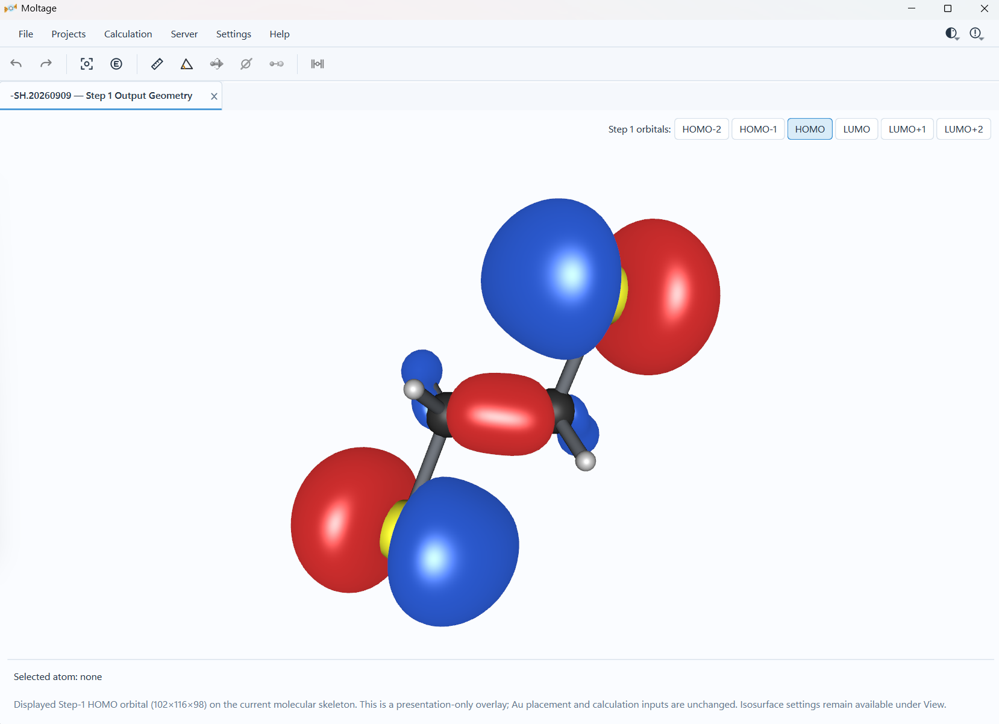

# 14. FHI-aims/AITRANSS Workflow and Molecular Orbitals

[Back to the manual index](README.md)

## 14.1 Workflow overview

The managed FHI-aims/AITRANSS workflow has four durable stages:

```text
Step 1 — Molecule Optimization
    ↓ recover and validate optimized molecule
Step 2 — Molecule–Au Optimization
    ↓ recover, then apply canonical Au pyramids
Step 3 — Transport Convergence
    ↓ validate fixed geometry and AITRANSS prerequisites
Step 4 — Transmission
    ↓ validate TE.dat and inspect T(E)
```

Each project remains bound to one server profile and one scheduler. Explicit
Refresh is required to reconcile remote state; Moltage does not poll a server in
the background.

Before starting, configure:

- an SSH server profile and remote project workspace;
- a validated Slurm or LSF client configuration;
- FHI-aims executable, environment, launcher, and species-definitions root;
- AITRANSS only before Step 4;
- scientifically reviewed calculation and resource settings.

## 14.2 Start-project dialog

**Entry:** `Calculation > FHI-aims > Step 1 — Molecule Optimization...`

When an eligible direct start exists, Step 2 or Step 3 is opened through its
corresponding Calculation command.

The start dialog contains:

| Field/control | Purpose |
| --- | --- |
| **Server** | Select the saved profile that owns the project |
| **Calculation engine** | FHI-aims/AITRANSS for this workflow |
| **Project name** | Safe editable base name; Moltage adds a date and collision suffix |
| **Detected structure** | Summary of recognized linkers/contact state |
| **Starting stage** | Confirm the eligible first real calculation stage |
| **Remote project preview** | Nominal managed directory name |
| **Cluster** | Scheduler/resource summary from the profile |
| **Email notification** | Current scheduler-native mail setting |
| **Cluster Settings...** | Return to incomplete scheduler/program configuration |
| **Continue** | Proceed to scientific settings; it does not submit yet |
| **Cancel** | Close without remote activity |

Project directory candidates are the unsuffixed dated name, then `_02`, `_03`,
and so on. Moltage attempts the next suffix only after an exact remote-directory
collision.

## 14.3 Step 1 — Molecule Optimization

### Entry and prerequisites

**Entry:** `Calculation > FHI-aims > Step 1 — Molecule Optimization...`

The active editable Geometry workspace must contain a supported molecular
structure. A missing server execution preset, runtime, species root, or output
filename blocks submission before a project directory is created.

### FHI-aims optimization settings

The **FHI-aims Optimization Settings** dialog separates general, spin, charge,
output, and atom-override settings.

| Setting | v0.2.1 initial value | Purpose |
| --- | --- | --- |
| **Functional** | PBE | Select the supported XC token |
| **vdW** | TS-Hirshfeld | Select none, TS-Hirshfeld, or TS-libMBD |
| **Relativity** | atomic ZORA scalar | Select scalar treatment or none |
| **Species accuracy** | tight | Select `light`, `tight`, or `really_tight` definitions from the configured server root |
| **Force threshold** | `1.e-2 eV/Å` | Positive BFGS geometry-convergence threshold |
| **Dipole** | On | Request dipole output |
| **Total charge** | `0` | Total system charge, independent of per-atom initial-charge guesses |
| **Spin polarization** | Off | Enable supported collinear spin initialization |

Supported XC choices are PBE, PBE0, BLYP, B3LYP, revPBE, and AM05. Hybrid
PBE0/B3LYP relaxations receive the reviewed `RI_method LVL_fast` directive.
Availability in Moltage is not a scientific recommendation.

### Spin controls

When spin polarization is enabled, select one initialization mode:

- **Per atom** — add atom overrides and supply at least one explicit nonzero
  initial moment.
- **Uniform default** — supply one nonzero initial moment per atom.

An optional fixed spin moment is a separate total-spin constraint. Do not
confuse total system charge, per-atom initial charge, initial spin density, and
fixed total spin.

### Orbital Cube output

The six frontier choices HOMO−2, HOMO−1, HOMO, LUMO, LUMO+1, and LUMO+2 start
selected. Optional positive 1-based absolute states can be added. Cube grid
spacing is optional:

- blank: keep the FHI-aims default grid;
- explicit Å value: Moltage generates the reviewed classic `cube origin` and
  `cube edge` records around the molecular bounds.

### Atom overrides

Use **Add atom override**, **Edit**, and **Remove** to configure one atom's:

- species-accuracy override;
- initial moment;
- initial charge guess.

Overrides follow the atom identity/order into generated input. They are
calculation settings; they do not alter the displayed chemical element.

### Final submission confirmation

The final dialog identifies the server, proposed project, stage, resources,
mail policy, and scientific summary. Enter a password only if the profile has no
usable saved credential. **Submit** is the authorization point for remote
mutation; **Cancel** creates nothing.

Moltage then:

1. performs scheduler/runtime preflight;
2. reads only the required server-side species definitions;
3. materializes complete `geometry.in`, `control.in`, and scheduler script in
   memory;
4. allocates one new project directory;
5. uploads through temporary files and verifies SHA256;
6. dispatches the scheduler exactly once;
7. stores the returned Job ID and `QUEUED` state.

An ambiguous connection loss after dispatch becomes `UNKNOWN` and is never
automatically submitted again.

### Step-1 success and recovery

Scheduler completion alone is insufficient. Success requires the reviewed
FHI-aims normal-termination evidence and a valid `geometry.in.next_step` whose
atom count and ordered resolved elements match the submitted molecule.

Use Project Manager **Refresh Status** or **Open / Recover**. A successful
recovery opens the optimized geometry as a new managed Geometry workspace.

## 14.4 Molecular-orbital visualization

When Step 1 requested canonical orbital Cube files and the corresponding remote
files exist and are nonempty, buttons appear at the upper right of the recovered
workspace.

<p align="center">
  
</p>

**Figure 9.** HOMO overlay for the example molecule. The surface is
presentation-only.

### Load an orbital

1. Click HOMO−2, HOMO−1, HOMO, LUMO, LUMO+1, LUMO+2, or an available absolute
   state.
2. Moltage reconnects briefly and downloads only that exact bound Cube file.
3. The Cube atom header must match the authoritative recovered Step-1 geometry.
4. The signed scalar field is overlaid on the molecular skeleton.

The binding can remain valid after accepted contact-Au placement, including its
recorded terminal-H removal. Unrelated atom/coordinate changes invalidate it.

### Isosurface settings

**Entry:** `Settings > View... > Isosurface` while a Cube/orbital surface is
active.

| Setting | Initial value | Effect |
| --- | --- | --- |
| Display style | Opaque | Opaque or fixed 50% semi-transparent surface |
| Display resolution | Workspace-dependent | Full/Medium/Low where offered; presentation only |
| Isovalue | `0.02` for new standalone surfaces | Changes the extracted positive/negative contour; zero hides it |
| Positive lobe | Red | Display color only |
| Negative lobe | Blue | Display color only |
| Ambient light | `0.90` | Fill/directional-light balance |
| Light intensity | `0.82` | Effective orbital-lobe brightness |
| Specular | `0.30` | White specular-highlight strength |
| Shininess | `32` | Specular exponent |

**Apply Recommended Material** previews ambient `0.55`, intensity `0.95`,
specular `0.30`, and shininess `32`. It does not change isovalue, colors, or
opacity. **OK** persists the four lighting/material values per user; **Cancel**
restores the values present when the dialog opened.

An orbital overlay never changes calculation input, Au placement coordinates,
or later workflow eligibility.

## 14.5 Step 2 — Molecule–Au Optimization

### Two entry paths

1. **Normal continuation:** recover a successful Step-1 structure, apply the
   two accepted contact-Au proposals, then use
   `Calculation > FHI-aims > Step 2 — Molecule–Au Optimization...`.
2. **Direct Step 2:** open an eligible local structure with exactly two
   recognized linker termini, one attached contact Au per terminus, and no other
   Au; confirm that Step 1 will be `SKIPPED`.

Viewer-added contact Au is valid Step-2 input and is not fixed during
optimization.

### Settings and submission

Step 2 collects a fresh FHI-aims optimization settings set. It does not silently
inherit Step-1 scientific choices. Normal continuation uses the existing project
UUID/root and creates only `molecule_Au`; direct Step 2 creates a new project
with Step 1 marked `SKIPPED`.

No Step-1 result is fabricated for a direct start. Upload, hash verification,
scheduler preflight, at-most-once dispatch, and scientific recovery use the same
boundaries as Step 1.

### After recovery

A successful Step-2 recovery loads the optimized molecule–contact-Au structure.
Use the Electrode Builder to apply both canonical pyramids. Step 3 remains
disabled until the current workspace contains the exact accepted two-sided
electrode result.

## 14.6 Step 3 — Transport Convergence

### Entry and prerequisites

**Entry:** `Calculation > FHI-aims > Step 3 — Transport Convergence...`

Normal eligibility requires successful Step 2, recovered optimized source, and
both accepted pyramids. A direct imported Step-3 start additionally requires
source-resident optimized contact Au and explicit user confirmation that the
molecule–Au geometry is already appropriately optimized. Viewer-added contacts
cannot skip Step 2.

### Step-3 settings

Step 3 is fixed-geometry and has no relaxation, force threshold, dispersion, or
optimization output.

| Field | Initial value | Purpose |
| --- | --- | --- |
| **XC** | PBE | Supported XC choice |
| **Basis preset** | tight | Server-side species accuracy |
| **Spin** | None | Optional supported uniform collinear initialization |
| **Initial moment / atom** | Disabled with spin None | Required nonzero value for enabled Step-3 spin mode |
| **Total charge** | `0` | Total system charge |
| **Gaussian width** | `0.01` | Occupation width |
| **n_max_pulay** | `10` | Pulay history length |
| **charge_mix_param** | `0.2` | Charge-mixing parameter |
| **sc_accuracy_rho** | `1E-5` | Density convergence threshold |
| **sc_accuracy_eev** | `1E-3` | Eigenvalue-sum threshold |
| **sc_accuracy_etot** | `1E-6` | Total-energy threshold |
| **sc_iter_limit** | `500` | Maximum SCF iterations |
| **Orbital state numbers** | Blank | Optional positive absolute state numbers only |
| **Cube grid spacing** | Blank | Keep FHI-aims default unless explicitly set |

Fixed generated directives are `output aitranss`, `KS_method serial`, and
`restart aims.restart`.

### Submission and result

The confirmation shows current Step-2/electrode state, server, scheduler
resources, mail setting, and scientific summary. Submission creates or reuses
the canonical `molecule_Au/transport` directory, uploads exactly the three
prepared Step-3 inputs, dispatches once, and reports Job ID/path without waiting
for output.

Scientific success requires:

- scheduler-terminal success;
- exact FHI-aims normal termination;
- exact submitted-geometry hash and matching positive atom count;
- nonempty, consistent AITRANSS matrix/orbital prerequisite files;
- positive and consistent NSAOS evidence.

Missing output can remain `SCHEDULER_COMPLETED` for a later explicit refresh.

### Timeout/OOM retry

Reviewed timeout or memory failures can expose **Resubmit Step 3...** in Project
Manager. Only resources are edited. Geometry, `control.in`, restart file, and
prior attempt history are preserved; no retry occurs automatically.

## 14.7 Step 4 — AITRANSS Transmission

### Entry and prerequisites

**Entry:** open/recover the successful Step-3 Geometry workspace, then choose
`Calculation > FHI-aims > Step 4 — Transmission...`.

Moltage verifies Step-3 geometry and prerequisite evidence, resolves the six
surface reference atoms from persisted electrode metadata, and checks the saved
AITRANSS runtime. A stale/missing runtime leaves the editor visible but disables
submission.

### System and surface fields

| Field | Meaning |
| --- | --- |
| `$natoms` | Atom count derived from validated Step-3 evidence |
| `$nsaos` | AO count derived from matrix/orbital headers |
| `$lsurc`, `$lsurx`, `$lsury` | Three distinct Left reference-plane Au atom numbers |
| `$rsurc`, `$rsurx`, `$rsury` | Three distinct Right reference-plane Au atom numbers |
| `$nlayers` | Independent AITRANSS electrode-layer parameter |
| **Source** | `AIMS_RECOMMENDED`, `USER_SPECIFIED`, or missing-evidence explanation |

Initial `$nlayers` evidence in v0.2.1:

| Pyramid layers | Initial `$nlayers` | Classification |
| --- | --- | --- |
| 4 | 2 | `AIMS_RECOMMENDED` |
| 5 | 3 | `AIMS_RECOMMENDED` |
| 6 | 4 | `USER_SPECIFIED` |
| 2, 3, 7–10 | Not configured | User must enter a positive value |

Editing any initial value marks it user-specified. Moltage does not derive a
formula and lattice extension never changes `$nlayers`.

### Transport and output fields

| Field | Purpose |
| --- | --- |
| `$s1i`, `$s2i`, `$s3i` | Reviewed transport controls used by AITRANSS |
| `$ener` | Starting energy |
| `$estep` | Energy step |
| `$eend` | Requested upper bound |
| `$output file` | Safe result filename referenced by active `tcontrol` |
| `$testing` | Explicit on/off AITRANSS option |
| `$ecp` | Explicit on/off AITRANSS option |

The dialog renders a live **Generated tcontrol preview** and reports validation
errors. Do not treat editable values as recommendations; use the relevant
AITRANSS documentation and your validated workflow.

### Step-4 resources

- Slurm: AITRANSS CPU threads, runtime, memory per node, and current mail policy.
- LSF: job slots/AITRANSS threads, runtime, and either submitted structured
  memory reservation or an explicit site-default explanation.

Step 4 runs one AITRANSS program instance. The configured Direct or verified
absolute-srun policy is used on Slurm; Moltage never emits a bare `srun`.

### Submission and success

On **Submit**, Moltage revalidates prerequisites and uploads only `tcontrol` and
the Step-4 scheduler script. Existing conflicting active files are not
overwritten. The scheduler dispatch occurs at most once.

Step 4 becomes successful only when the current-attempt scheduler state,
reviewed positive program markers, parseable active `tcontrol`, and complete
finite increasing result grid agree. Known interface-overlap or self-energy
format errors remain typed failures even when the scheduler reports success.

### Explicit self-energy retry

Only the reviewed electrode-interface-overlap failure offers
**Retry with explicit self-energy...**. Moltage previews interface counts and
current layer/transport controls, then preserves old inputs and uses new
attempt-specific self-energy, `tcontrol`, script, and output names. This retry is
never automatic and does not alter Step-3 geometry or matrices.

## 14.8 View AITRANSS transmission

After Step 4 is scientifically successful, use Project Manager
**View Transmission**. Moltage resolves the result from the parseable active
`tcontrol`; it does not glob for a likely file or choose the newest file.

The result viewer and its presentation controls are described in
[Analysis and Results](07_analysis_and_results.md).

[Next: ORCA workflow](06_orca_workflow.md)
