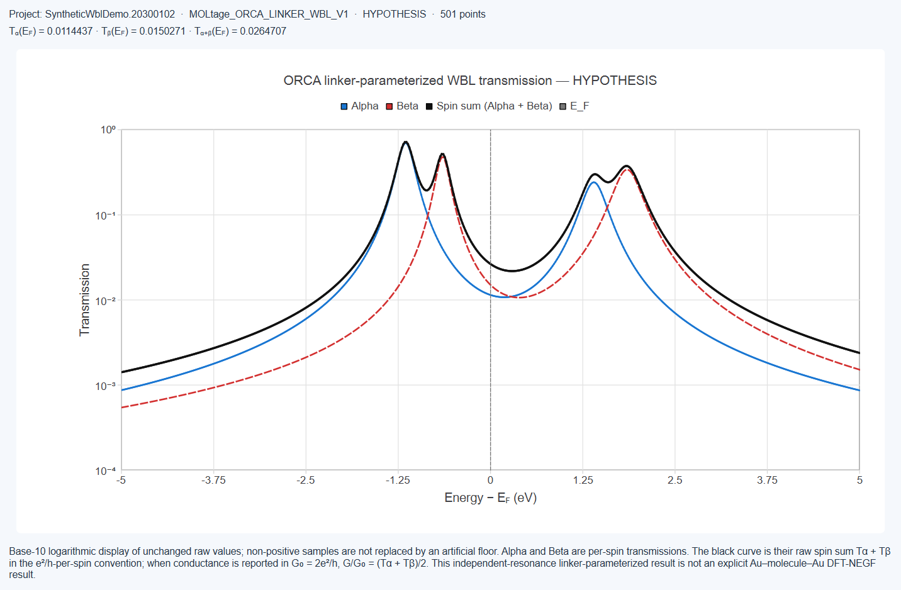

# 15. ORCA 优化、频率验证与 WBL Transmission

[返回手册目录](README.md)

## 15.1 ORCA 工作流的作用

Moltage 把 ORCA 作为独立于 FHI-aims 的工作流。ORCA 项目在 Project Manager 中有两盏进度指示灯：

```text
Step 1 — Optimization
    ↓ 恢复并验证优化几何和波函数
Step 2 — WBL Transmission
```

频率验证是在几何恢复后单独启动的可选分析，刻意不作为第三盏项目指示灯。ORCA 各阶段既不需要也不读取 `control.in`、`geometry.in`、FHI-aims species definitions 或 AITRANSS 文件。

开始前，请在所选服务器上配置并验证调度器和 ORCA 运行环境。参见[服务器与调度器](03_servers_and_schedulers.md)。

## 15.2 启动 ORCA 优化

打开分子 Geometry 标签页，然后选择 **Calculation → ORCA → Step 1 — Optimization...**。在显示科学参数前，对话框会先显示服务器名称、ORCA 可执行文件路径和已验证版本。

### ORCA 输入

| 设置 | 用途 | 初始行为 |
|---|---|---|
| **Method** | 电子结构方法 | 不自动选择方法 |
| **Basis** | 需要基组的方法所使用的轨道基组 | 不自动选择基组；复合方法会禁用此字段 |
| **Dispersion** | 在方法允许时可选 `NONE`、`D3ZERO`、`D3BJ` 或 `D4` | 必须由用户审核 |
| **Optimization** | 几何收敛：`LOOSEOPT`、`OPT`、`TIGHTOPT` 或 `VERYTIGHTOPT` | `OPT` |
| **Coordinates** | 冗余内坐标或笛卡尔优化坐标 | `REDUNDANT` |
| **SCF convergence** | `DEFAULT`、`STRONGSCF`、`TIGHTSCF` 或 `VERYTIGHTSCF` | `DEFAULT` |
| **Charge** | 分子净电荷 | `0`；仅为可编辑起始值 |
| **Multiplicity** | 自旋多重度 2S + 1 | `1`；用户必须设置正确的电子态 |

Moltage 会检查基本一致性，包括电子数与多重度的奇偶关系，但该检查无法判断物理上正确的电荷或自旋态。

维护的 method 列表包括 BP86、BLYP、PBE、TPSS、B3LYP、PBE0、M062X、TPSSH、B97-3C、PBEh-3c、r2SCAN-3c 和 ωB97M-D4Rev。系统只提供已验证 ORCA 版本支持的方法。对受支持元素，可选 def2-SVP、def2-TZVP、def2-TZVPP 和 def2-QZVP。Moltage 不会静默替换为其他 method 或 basis。

### 作业资源

**Nodes**、**ORCA processes**、**Maximum runtime** 和 **Scheduler memory** 初始取自所选服务器配置，并可针对本次作业更改。**Write `%maxcore`** 是可选项。启用时，数值表示每个 ORCA 进程可用的内存（MB），属于建议值而不是调度器内存限制。禁用时，Moltage 不写入 `%maxcore`，ORCA 使用其文档规定的默认值。省略该项是有效输入，本身不会导致计算失败。

当请求的 process memory 与调度器分配冲突时，Moltage 会显示内存提示。用户仍需根据分子、方法和集群选择合适数值。

### 确认并提交

选择 **Continue**，审核生成的 `orca_opt.inp` 和调度器脚本，然后明确提交。此确认对应真实的远程作业。Moltage 调用已验证的 ORCA 主程序绝对路径，不依赖 `PATH` 中碰巧存在的裸 `orca`、`srun` 或 `mpirun`。

项目根目录中的典型文件包括：

- `orca_opt.inp`：提交的 ORCA 输入；
- `submit.orca.sh`：调度器脚本；
- `orca_opt.out`：ORCA 输出；
- `orca_opt.scheduler.out`：调度器输出；
- `orca_opt.gbw`：Step 2 使用的波函数；
- `orca_opt.xyz`：ORCA 生成时的优化后笛卡尔几何。

实际辅助文件集合取决于所选方法和 ORCA 版本。

## 15.3 监控、恢复和重新提交 Step 1

使用 **Projects → Project Manager...** 和 **Refresh Status**。绿色 Step 1 指示灯不仅要求调度器为 `COMPLETED`：Moltage 还会验证 ORCA 正常终止、优化收敛、与哈希绑定的提交输入和原子顺序有效的最终几何。

选择 **Open / Recover** 打开当前最佳的受支持证据：

- 恢复完整时，打开已验证的优化几何；
- 否则在可用时以只读方式打开提交的输入几何。

当已验证的优化 Geometry 标签页处于活动状态时，**Calculation → ORCA** 子菜单中的 Step 2 和 Frequency 项会变为可用。

**Resubmit Optimization...** 会根据此前保存的设置初始化一个新项目。如果上一个作业仍可能活动，Moltage 会先刷新对应的调度器作业，并且只取消经验证仍活动的作业。如果状态不明确，系统会停止重新提交，以免产生重复计算。

## 15.4 可选频率验证

恢复已验证的优化结构后，选择 **Calculation → ORCA → Run Frequency...**。频率分析独立于 WBL，绝不会自动启动。

Method、basis、dispersion、charge 和 multiplicity 会以只读方式继承自优化。请选择一种模式：

- **FREQ — analytical Hessian**：当前方法和运行环境受到支持时使用；
- **NUMFREQ — numerical Hessian**：执行许多位移梯度计算，计算成本可能显著更高。

设置频率作业的资源，并按需启用 `%maxcore`。完成后会报告 ORCA 标注的虚频模式。没有报告虚频可作为局部极小值的有用证据，但不能证明该结构是全局极小值。

## 15.5 准备 ORCA WBL transmission

在已恢复的 ORCA Geometry 标签页中选择 **Calculation → ORCA → Step 2 — WBL Transmission...**。该阶段分析已有波函数，**不会**重新运行 SCF 或几何优化，也不使用 Multiwfn。

前置条件：

- Step 1 已验证完成，且几何有效；
- 项目记录中的 `orca_opt.gbw`；
- 已验证 ORCA 可执行文件同目录下兼容的 `orca_2json`；
- 受支持且完整的 basis、MO、spin 和 overlap 证据。

Moltage 对现有 GBW 运行转换工具，读取生成的波函数数据，在本地计算 WBL 模型，然后把结果和来源记录文件上传到项目的 `wbl/` 目录。此步骤不提交调度器作业。

## 15.6 WBL 接触设置

基本视图只保留当前计算必需的输入。

### 接触原子与 linker 识别

当识别到两个无歧义且受支持的 linker 接触时，Moltage 会自动填写左、右接触原子。改变接触原子会同步更新识别到的 linker。支持的 linker 类型为 SH、SMe、NH2 和 pyridine。

若要手动选择，使用 **Manual select in viewer...**。设置对话框会暂时隐藏，分子查看器会显示原子编号；单击受支持的 S 或 N 原子即可填写该字段。系统按原子编号记录选择，不会把鼠标位置解释为任意三维坐标。

### Γ₀ 耦合

输入以 eV 为单位的正 **Γ₀**。Moltage 刻意不提供 Γ₀ 数值默认值，因为它是模型耦合参数，而不是普适 linker 常数。右侧初始启用 **Same as left**；只有确实需要不同耦合时才取消勾选。数值编辑器显示 `eV` 后缀并拒绝字母输入。

### 能量窗口与采样

| 设置 | 初始值 | 含义 |
|---|---:|---|
| **Au Fermi level, E<sub>F</sub>** | −5.1 eV | 可编辑的通用 Au/真空参考假设，不是普适表面数值 |
| **Lower energy, E − E<sub>F</sub>** | −5 eV | 相对能量窗口起点 |
| **Upper energy, E − E<sub>F</sub>** | +5 eV | 相对能量窗口终点 |
| **Sampling interval** | 0.01 eV | 用于计算曲线的能量间隔 |

比较多个分子或不同电荷/自旋态时，应使用一致的能量参考、窗口、采样和耦合定义。

## 15.7 WBL 高级接触设置

只有在自动解释不适用时才打开 **Advanced contact settings...**。

- **Linker override**：在自动 linker 分配不可用或有歧义时覆盖其结果。
- **Γ₀ evidence**：记录输入值是用户提供的 `HYPOTHESIS`，还是已根据外部数据 `CALIBRATED`。它只改变来源标签，不改变 WBL 公式。
- **Contact orbital projection**：控制 Löwdin 接触子空间。接触确定后，`Auto` 会展开为实际选择的模型。
- **Projection direction override**：接受可选的分子 XYZ 单位方向 `x, y, z`。留空则使用从几何推导的方向。
- **Manual AO numbers**：只在 manual 模式中接受从 1 开始、以逗号分隔的 AO 索引。

自动 sulfur projection 使用沿接触方向的价层 S 3p 函数，不会混入内层 S 2p 函数。自动 nitrogen projection 使用沿孤对电子/接触方向的 N 2s/2p 价层空间；在适用时，也可使用垂直于已识别局部平面的 N 2p 方向。这些是方向性轨道投影，不是键能计算。

## 15.8 启动并监控 Step 2

选择 **Start Step 2**。应用会显示转换、波函数读取、计算、上传和验证进度。Project Manager 会立即把 ORCA 第二盏指示灯显示为活动状态；成功后变为绿色并启用 **View WBL Transmission**，失败后变为红色并保留明确诊断。

生成的结果集合包括：

- `orca_wbl_transmission.csv`：完整的能量/transmission 表；
- `orca_wbl_result.json`：设置、接触定义、贡献、工具信息和文件来源记录；
- `orca_wbl_transmission.svg`：确定性的绘图文件。

已验证数据中的所有分子轨道都会参与曲线。JSON 还记录 E<sub>F</sub> 处贡献最大的轨道。结果哈希保存在项目清单中，并在之后显示前验证。



**图 10.** 以对数坐标显示 transmission 曲线的 ORCA WBL 结果视图。图中数据
用于演示，不是实验测量或真实生产 HPC 结果。

## 15.9 解释 WBL 结果

对于已验证、multiplicity 为 1 的 restricted 波函数，Moltage 计算一条闭壳层总 transmission。传统自旋简并通过电导量子 G<sub>0</sub> = 2e²/h 计入，因此单轨道通道以 T = 1 为上限，不显示重复的 Alpha/Beta 曲线。

对于已验证的 unrestricted 开壳层证据，Moltage 显示 Alpha、Beta 和原始 spin sum。Alpha 和 Beta 是采用 e²/h 约定的逐自旋 transmission；以 G<sub>0</sub> 为单位报告电导时，应使用 G/G<sub>0</sub> = (T<sub>α</sub> + T<sub>β</sub>) / 2。

纵轴采用以 10 为底的对数坐标，并用 10<sup>−3</sup> 这样的规范幂指数排版。非正样本不会被替换为人为下限。该模型始终是 linker 参数化、独立共振的 WBL **HYPOTHESIS**，不是显式 Au–molecule–Au DFT-NEGF 计算，也不应如此描述。

[下一章：分析与结果](07_analysis_and_results.md)
