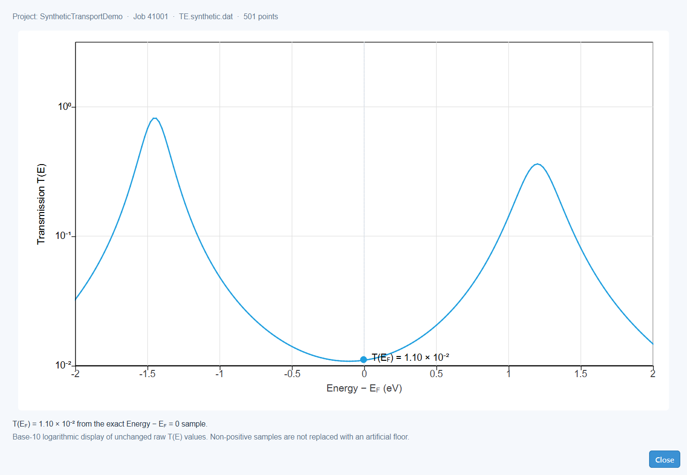

# 16–18. 分析与结果视图

[返回手册目录](README.md)

## 16. AITRANSS transmission 结果

FHI-aims/AITRANSS Step 4 成功后，在 Project Manager 中选择项目并单击 **View Transmission**。Moltage 会验证活动 `tcontrol` 明确指定的结果文件，不会仅因为某个文件是最新匹配项就选择它。



**图 11.** 使用示例数据的 AITRANSS transmission 结果视图。

### 读取图表

- 横轴是相对于 E<sub>F</sub> 的能量，单位 eV。
- 纵轴是在以 10 为底的对数坐标上显示的未经修改的原始 transmission T(E)。
- 数量级使用 10<sup>−3</sup> 这样的标准幂指数格式，而不是 `1E-3`。
- 垂直虚线标记 E<sub>F</sub>。
- 在支持插值时，T(E<sub>F</sub>) 根据左右两个原始样本计算；状态文字会说明该值是精确值、插值结果还是不可用。
- 非正数据不会被替换为人为设置的正下限。

将鼠标移动到曲线附近可查看最近的样本。单击点附近可固定读数；单击图中空白位置可解除固定。固定一个点后，可以使用键盘在可见正样本之间移动。

### 调整显示

结果标签页处于活动状态时，选择 **Settings → View...**。Transmission View Settings 对话框有五页：

| 页面 | 控件 |
|---|---|
| **X Axis** | 范围、标题、字体、轴/网格外观和可选镜像轴 |
| **Y Axis** | 正对数范围、标题、字体、轴/网格外观和可选镜像轴 |
| **Ticks** | 方向、主/次刻度长度与宽度、可见性和间隔 |
| **Curve** | 曲线颜色、宽度、线型和图例可见性 |
| **Canvas** | 导出尺寸、背景/边框和图边距 |

双击坐标轴会打开对应轴页面；双击曲线打开 **Curve**；双击画布打开 **Canvas**。**Apply** 只更新显示，不会改写科学结果。工具栏中的 **Reset View** 恢复固定的默认范围。使用 **File → Export Current View...** 按请求的比例保存样式化图表。

## 17. 电子密度差

在可编辑 Geometry 工作区中选择 **Calculation → FHI-aims → Electron Density Difference...**。这是独立的固定几何计算，不是 AITRANSS 阶段，也不属于四步输运项目。

科学定义为：

```text
Δρ = ρ(total) − ρ(subset 1) − ρ(subset 2)
```

正值表示电子积累，负值表示电子耗尽。结果包括相互作用引起的重排和极化；它本身不是片段间转移电荷的唯一度量。

### 17.1 Fragments 页面

每个原子必须且只能属于两个非空片段中的一个。

- **Active fragment**：选择 Subset 1 或 Subset 2。
- **Mouse**：选择点选、矩形选择或相机旋转。
- **Remove from active fragment**：使后续选取操作从活动片段中移除原子。
- **Subset 1 / Subset 2**：接受原子编号范围，例如 `1-20,25,31-40`。
- **Add all remaining atoms**：把所有尚未分配的原子加入活动片段。

点选和矩形选择是连续操作。把原子分配给一个 subset 会自动从另一个 subset 中移除。矩形选择使用投影后的原子中心，包括被其他原子遮挡的中心。开环和原子编号用于标识两个 subset，不会改变坐标。

### 17.2 States 页面

**XC** 和 **Species** 应用于三次 SCF。Total、Subset 1 和 Subset 2 各自具有独立 charge 和可选的共线 spin initial moment。**Derive Subset 2 charge = Total − Subset 1** 初始启用。

片段 charge 和 spin 描述独立的参考计算。特别是，切断共价键后可能需要开壳层片段。中性、非 spin 的初始值不代表对正确物理状态的判断。

### 17.3 SCF & Grid 页面

此页提供 occupation width、Pulay/mixing、收敛字段、SCF iteration limit、**Grid spacing** 和 **Boundary padding**。网格初始设置为 0.1 Å 间距和以 Å 表示的 14 bohr 边界余量。它们是起始设置，不是收敛保证。Moltage 为所有组成部分创建同一个显式网格，绝不会静默重采样不匹配的科学输入。

### 17.4 Server & Resources 页面

选择服务器和任务名称，然后审核该配置所用调度器的资源。一个调度器作业会依次运行 Total → Subset 1 → Subset 2，因此最大运行时间必须覆盖三次 SCF。FHI-aims 运行环境和元素定义设置来自服务器配置；不需要 AITRANSS。

新任务使用 **Submit**。**Refresh Status**、**Recover Results** 和 **Retry Failed Components** 会根据任务状态变为可用。三盏指示灯分别表示 Total、Subset 1 和 Subset 2；它们是同一个作业中的连续组成部分，不是三次独立提交。右键单击活动指示灯可取消对应的共享调度器作业。

重试会保留已成功验证的组成部分，并对未成功部分复用原始输入字节。已停止或失败的任务也可重新打开，并用 **Resubmit with Changes** 创建新任务，原任务保持不变。

### 17.5 结果视图

恢复流程会在把组成部分标记为绿色前，验证已收敛/终止的输出、原子顺序一致的固定几何、Hirshfeld charge 和公共网格 Cube 数据。调度器成功本身并不足够。

结果视图包括：

- total 和 fragment Hirshfeld charge 与 electron gain 表格；
- 正/负电子密度差等值面；
- **Display resolution** 的 Full、Medium 和 Low 选项；
- **Density difference** 或 **Total/reference density** 显示模式；
- 从 0 到 1 的 **Density Interpolation** λ；
- 用于等值面外观的 **View...**；
- 用于生成可复现结果目录的 **Export report...**。

Medium 和 Low 只影响显示网格的提取。已验证 Cube 场、相减结果、Hirshfeld 数值、积分和导出数据仍保持完整源分辨率。插值定义为 `ρλ = ρsubset1 + ρsubset2 + λΔρ`；它只是一种可视化方式，不代表时间演化、物理电流或电子轨迹。

导出会创建新目录，绝不会覆盖已有报告。目录包含 `difference.cube`、`atom_charges.csv`、`fragment_charges.csv`、`analysis_manifest.json` 和 `report.html`。

## 18. 本地紧束缚 transmission

在 Geometry 工作区中选择 **Calculation → Local Tight-Binding Transmission...**。这是仅存在于当前会话的探索模型，不连接服务器、不创建远程计算项目，也不提供取决于具体化学体系的参数。

该模型是正交、单轨道、实数键耦合、无自旋且相干的模型。所有能量均以 E<sub>F</sub> = 0 eV 为参考。其输出是模型结果，不是从头算输运计算。

### 18.1 Contacts

- **Linker candidate**：列出检测到的锚定候选。
- **Use as Left / Use as Right**：把所选候选复制为左/右接触。
- **Left atom / Right atom**：接受原子编号。
- **Pick Left / Pick Right**：允许在查看器中直接选择。
- **Γ Left / Γ Right**：必填的正耦合值，单位 eV。

检测只提供候选。如果存在显式电极，请选择实际与理想化导线耦合的原子。

### 18.2 Atom Energies

为每种元素输入一个必需 onsite energy ε。单击原子可为其设置精确覆盖值；清除覆盖后，该原子重新继承元素值。

### 18.3 Bond Couplings

为当前连接关系中每种无序元素对输入一个必需 hopping value t。单击显示的键可精确覆盖它。MOL bond order 只作为视觉参考，不会生成耦合值。

### 18.4 Energy Grid

输入包含端点的 start、不包含端点的 end、正 step 和正数值 η，单位均为 eV。η 是显式展宽参数，会改变计算曲线。

可移动的 **Hamiltonian H (eV)** dock 会显示应用所有类型值和精确覆盖值后的有效矩阵。只有所有必填值均有效时，**Calculate** 才可用。首次计算后，编辑会触发当前会话中的有界重新计算。关闭标签页会丢弃该本地状态。

## 18.5 这些结果不能证明什么

- AITRANSS T(E) 只有在输入经过验证，并且接受相应 FHI-aims/AITRANSS 工作流假设时才有意义。
- ORCA WBL 是 linker 参数化的假设，不是显式电极 DFT-NEGF。
- 本地紧束缚是由用户显式参数化的说明性模型。
- 电子密度差显示所选片段分解下的结果，不是唯一的电荷转移观测量。

在图片、图注、报告和比较中都应保留这些边界。

[下一章：文件、故障排除与参考](08_files_troubleshooting_reference.md)
